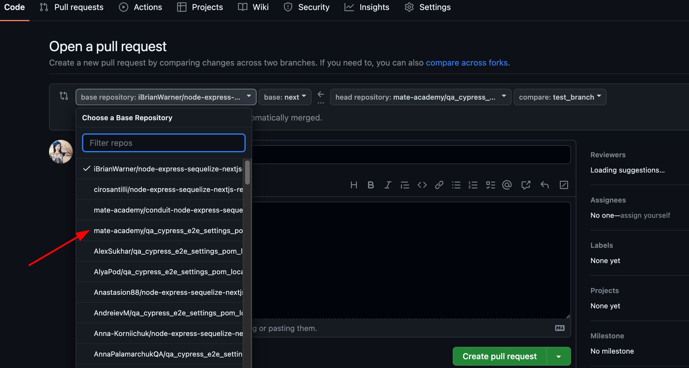

# Cypress: Settings
pomoz mi napisac testy. w cypress mam katalog e2e a wnim :
article.cy.js:/// <reference types="cypress" />
/// <reference types="../support" />

describe('Article', () => {
  before(() => {

  });

  beforeEach(() => {
    cy.task('db:clear');
  });

  it('should be created using New Article form', () => {

  });

  it('should be edited using Edit button', () => {

  });

  it('should be deleted using Delete button', () => {

  });
});
settings.cy.js:/// <reference types="cypress" />
/// <reference types="../support" />

describe('Settings page', () => {
  before(() => {

  });

  beforeEach(() => {

  });

  it('should provide an ability to update username', () => {

  });

  it('should provide an ability to update bio', () => {

  });

  it('should provide an ability to update an email', () => {

  });

  it('should provide an ability to update password', () => {

  });

  it('should provide an ability to log out', () => {

  });
});
signIn.cy.js:/// <reference types='cypress' />
/// <reference types='../support' />

import SignInPageObject from '../support/pages/signIn.pageObject';
import homePageObject from '../support/pages/home.pageObject';

const signInPage = new SignInPageObject();
const homePage = new homePageObject();

describe('Sign In page', () => {
  let user;

  before(() => {
    cy.task('db:clear');
    cy.task('generateUser').then((generateUser) => {
      user = generateUser;
    });
  });
  
  it('should provide an ability to log in with existing credentials', () => {
    signInPage.visit();
    cy.register(user.email, user.username, user.password);

    signInPage.typeEmail(user.email);
    signInPage.typePassword(user.password);
    signInPage.clickSignInBtn();

    homePage.assertHeaderContainUsername(user.username);
  });

  it('should not provide an ability to log in with wrong credentials', () => {

  });
});
dignUp.cy.js:/// <reference types="cypress" />
/// <reference types="../support" />

describe('Sign Up page', () => {

  before(() => {

  });

  it('should ...', () => {

  });
});
user.cy.js:/// <reference types="cypress" />
/// <reference types="../support" />

describe('Follow/unfollow button', () => {
  before(() => {

  });

  it.skip('should provide an ability to follow the another user', () => {

  });
});
Ponadto jest tam wiele plikow typu pages. czy podac ci mojego linka do mojego repo abys mogl sie z nimi zapoznac ? o to moj link:https://github.com/webEsperer/qa_cypress_e2e_settings_pom_local

## Workflow

1. Fork the repo.
1. Clone **your** forked repository.
1. Clone [this](https://github.com/iBrianWarner/realworld) repo into you repo.
1. Create a new branch `git checkout -b e2e_testing`.
1. Run the [app](./DEV.adoc) (Local development with SQLite).
1. Resolve tasks.
1. Record a video of your running your tests (you can use Loom).
1. Check yourself before submitting the task with a [Cypress checklist](https://mate-academy.github.io/qa-program/checklists/cypress.html).
1. Create a pull request.
   - note, you have to make a PR to this branch:
    
1. Attach a link to your video to the PR description.
1. Do not forget to click on `Re-request review` if you submit the homework after previous review.

## Task

Go to `e2e` folder and cover listed functionality with e2e tests:

- updating bio;
- updating username;
- updating email;
- updating password.

### Requirements

1. Clear all data from the database before the test.
1. Add `data-cy` attributes for all elements you are working with in tests.
1. Use faker and custom methods to generate a fake data in tests.
1. Use PageObject pattern for your tests:
   - create a files with POM classes for your pages in `cypress`/`support`/`pages`.
   - use `PageObject.js` file for the common for the whole app elements.

Observe an example in `cypress`/`e2e`/`signIn.cy.js`.  
Find and additinoanl about Page Object in the [Cypress](https://mate.academy/learn/javascript-testing/cypress#/theory) topic.

Hint

 
:bulb: Be mindful of data validation when generating test data for API requests. Some randomly generated values may not meet the API’s validation rules, causing tests to fail. To avoid flaky test behaviour, ensure that your data generation method produces valid values. You can adjust the data generation by using different `faker` methods or by passing different configuration options (if the method supports them).

 
